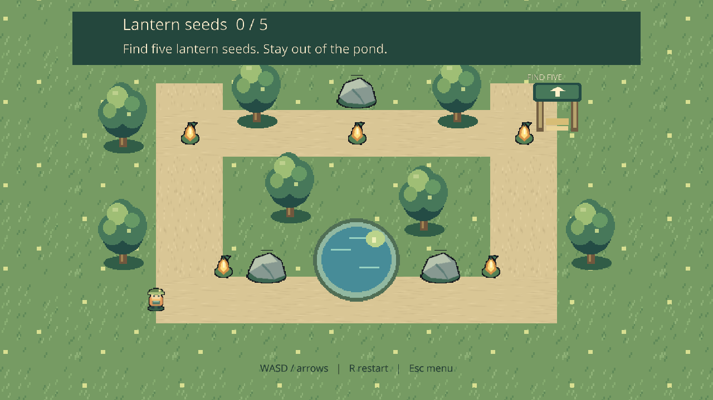
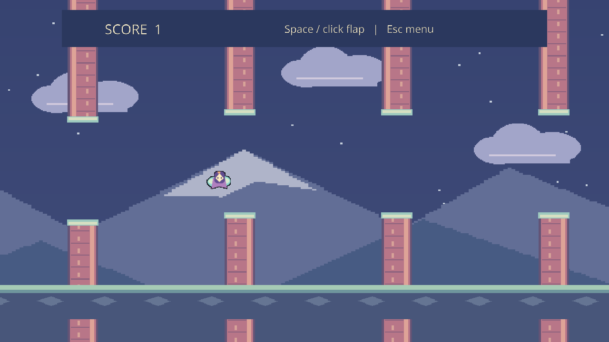

# Hazel

A Linux/Windows extension of [TheCherno/Hazel at the pinned import](https://github.com/TheCherno/Hazel/tree/1feb70572fa87fa1c4ba784a2cfeada5b4a500db). **Hazelnut** is the editor; **Nutella** runs projects independently. Engine code, managed scripting, Box2D, YAML scenes, and 2D/MSDF rendering share the existing Hazel architecture. These runtime/session and deployment changes are local development, not claims about upstream's future design.

## Binaries

Verified Release downloads for implementation checkpoint **`7e8d844`**:

- [Windows x64 — Hazelnut and Nutella](https://github.com/cringlekaden/Hazel/actions/runs/37118805605/artifacts/11273050613)
- [Linux x86_64 — Hazelnut and Nutella](https://github.com/cringlekaden/Hazel/actions/runs/37118805605/artifacts/11271819482)

Both artifacts contain separate application archives and SHA-256 checksums. [Verification run](https://github.com/cringlekaden/Hazel/actions/runs/37118805605) passed Windows/Ubuntu Debug and Release regressions and actual extracted-package tests with source resources and SDK unavailable. Testing evidence is a separate artifact. Review downloads require a GitHub login; no release has been published. [Later feature branch builds](https://github.com/cringlekaden/Hazel/actions/workflows/c-cpp.yml?query=branch%3Afeature%2Fexample-games) are available through successful CI runs.

Extract an application archive, then launch `Nutella.exe` / `Nutella` or `Hazelnut.exe` / `Hazelnut`. Nutella discovers the included root project and starts MainMenu. Hazelnut opens its bundled Example. Click **Play** inside the game (first start editor Play with the toolbar triangle); Level1 uses A/D and Space, with a clickable Menu control and Escape fallback. Working directory, spaces and Unicode in the extraction path are supported.

Packages need no checkout, build tools, shader SDK or script compiler. Requirements: OpenGL **4.1 core** or newer, Windows **10 x64** or newer; official Linux CI builds target **Ubuntu 24.04 / glibc 2.39** or newer with an X11/GLX display and system OpenGL driver. Local CachyOS packages carry their build host's glibc baseline. Native dependencies, Mono, Release CRT (Windows), engine resources and precompiled scripts are included. Software graphics used by CI stays outside production archives. See each archive's `LAUNCH.txt`, `build.json`, `SHA256SUMS` and licenses.

## Setup

```sh
git clone --recurse-submodules https://github.com/cringlekaden/Hazel.git
cd Hazel
git switch feature/example-games
scripts/setup.sh                         # Linux
```

```powershell
./scripts/setup.ps1                     # Windows
```

Setup diagnoses prerequisites, initializes exact submodule pins, bootstraps project-owned pinned Premake, prepares shader dependencies through Premake, generates projects, and builds/stages Debug with **two jobs**. Repeating setup/build is incremental; commands serialize through a build lock. No system packages are installed by setup. Python dependencies/tools and generated output live in ignored `build/`; distributions live in ignored `dist/`. CMake is not required. The required Premake compatibility shim and dependency provenance remain under `scripts/dependencies`.

Install prerequisites explicitly if missing (these commands require administrator privileges; setup never elevates):

```sh
# CachyOS / Arch (Mono is bootstrapped as an isolated, checksum-pinned SDK
# when unavailable; HAZEL_MONO_SDK can reuse an existing SDK)
sudo pacman -S --needed base-devel git python python-pip libarchive util-linux-libs pkgconf gtk3 libx11 libxext libxrandr libxinerama libxcursor libxi libglvnd
# Ubuntu 24.04
sudo apt-get install build-essential git python3 python3-pip pkg-config mono-devel uuid-dev libgtk-3-dev libx11-dev libxext-dev libxrandr-dev libxinerama-dev libxcursor-dev libxi-dev libgl1-mesa-dev libegl1-mesa-dev
```

Windows: Python 3, Git, Visual Studio **2022 Build Tools** with C++ x64/x86 tools, Windows SDK, MSBuild, and **.NET Framework 4.7.2 targeting pack**. The IDE is optional; tooling uses `vswhere` and MSBuild discovery. The pinned Windows Mono SDK is already in the repository. All native targets retain MDd for Debug and MD for Release, and UTF-8 source configuration.

## Commands

Use `python3` on Linux or `python` on Windows, from any directory, with the script's full path when outside the checkout. Each subcommand supports `--help`.

```sh
python3 scripts/hazel.py build                          # incremental Debug
python3 scripts/hazel.py build --config Release
python3 scripts/hazel.py run Hazelnut --project examples/SceneTransitions/SceneTransitions.hproj
python3 scripts/hazel.py run Nutella                     # development example
python3 scripts/hazel.py script-build examples/SceneTransitions/SceneTransitions.hproj --config Release
python3 scripts/hazel.py package --project examples/SceneTransitions/SceneTransitions.hproj
python3 scripts/hazel.py package --app Nutella --project /path/to/Game.hproj
python3 scripts/hazel.py build --tests
python3 scripts/hazel.py test --config Debug
python3 scripts/hazel.py test-packages                   # extracted example archive acceptance
python3 scripts/hazel.py database                       # explicit Bear/clangd refresh
```

Project packaging validates scenes, textures, compiled script classes/assembly references, and native dependency closure. External asset paths/symlinks are rejected with instructions to relocate them into the project and save relative references. Project P/Invoke requires explicit native redistribution support; packaging rejects it rather than silently depending on the source machine. Precompiled scripts run without a compiler. Use **File > New Project**, **Project > Create Script / Build Scripts / Export Game**, and **Edit > Editor Preferences** for ordinary authoring. Configure a Hazel source SDK and Python there; precompiled Play needs neither. New projects generate the canonical Premake configuration, honoring `HAZEL_SCRIPTCORE` and `HAZEL_SCRIPT_OUTPUT`; `script-build` compiles against the matching Hazel-ScriptCore, keeps configuration outputs in the SDK cache, and atomically deploys the configured module and its dependencies.

Nutella's public launch contract:

```text
Nutella                             Run the only root .hproj beside the executable
Nutella --project <project.hproj>    Select explicitly; relative paths use invocation cwd
Nutella --list-projects              Sorted root candidates; no graphics or Mono
Nutella --help                       Usage; no graphics or Mono
```

Zero/multiple candidates and invalid arguments fail usefully with nonzero status. A `.hproj` specifies StartScene and assets; loose assets do not identify a game. Engine resources default to executable-adjacent `Resources`, Mono to `mono`, writable data to platform user data (`~/.local/share/Hazel/<app>` / `%LOCALAPPDATA%/Hazel/<app>`). `HAZEL_RESOURCES`, `HAZEL_MONO`, `HAZEL_DATA` are explicit root overrides, without cwd search heuristics. Shader caches keep content identity and corruption recovery.

Managed `Hazel.Scene.LoadScene("Scenes/Level1.hazel")` **requests** a scene transition from a main-thread callback. It returns void and does not report successful loading. The first accepted request wins; duplicates coalesce. At the beginning of the next runtime Update, outside callbacks/registry iteration, the target is staged/validated, then old scripts/physics stop and new state starts. Failure is logged and keeps the current scene usable. Stop cancels pending work. Ordinary transitions reuse the project script environment. Hazelnut retains authored scene/fields independently throughout Play.

## Playable examples

**[MeadowRun](examples/MeadowRun/README.md)** is a small garden expedition: restore three gardens (Meadow, Orchard Paths and Lantern Grove), collect five lantern seeds per stage, and recover safely from each pond. WASD/arrow keys move; R restarts; Escape returns to the menu.

**[Skybound](examples/Skybound/README.md)** follows an original wind sprite through lantern towers. Space/left click flap; fresh Space/R or Try Again restarts after death; Escape/Title Menu returns. A ready state prevents the title click from starting flight accidentally. Four active obstacle pairs are spawned from prefabs with fresh identities and destroyed as they leave the course; scoring and movement use fixed simulation steps.




Captured title and end states: [MeadowRun title](docs/images/meadowrun-title.png), [completion](docs/images/meadowrun-complete.png), [Skybound title](docs/images/skybound-title.png), [game over](docs/images/skybound-over.png).

These are real engine captures, not mockups. Each project owns its scenes, textures and assembly. Stable layouts are authored in `.hazel` files; inspector-visible script fields tune movement and rules. Both use the shared RuntimeSession and managed scene-loading API. Their cameras fit a fixed 16 x 12 area, keeping gameplay visible across aspect ratios. Original art and redistribution terms are recorded per project; regeneration is optional and needs Pillow only on the author's machine.

After engine setup, substitute `MeadowRun` or `Skybound` for `<Game>` (Windows: use `python`):

```sh
python3 scripts/hazel.py script-build examples/<Game>/<Game>.hproj
python3 scripts/hazel.py run Hazelnut --project examples/<Game>/<Game>.hproj
python3 scripts/hazel.py run Nutella --project examples/<Game>/<Game>.hproj
python3 scripts/hazel.py build --config Release
python3 scripts/hazel.py script-build examples/<Game>/<Game>.hproj --config Release
python3 scripts/hazel.py package --app Nutella --project examples/<Game>/<Game>.hproj --name <Game> --output dist/games
python3 scripts/hazel.py test-games                  # requires build --tests
python3 scripts/hazel.py test-games --config Release --packages
```

Verified game downloads from the same CI run (GitHub login required):

| Game | Windows x64 | Linux x86_64 |
| --- | --- | --- |
| MeadowRun | [Download](https://github.com/cringlekaden/Hazel/actions/runs/37118805605/artifacts/11272612590) | [Download](https://github.com/cringlekaden/Hazel/actions/runs/37118805605/artifacts/11271819917) |
| Skybound | [Download](https://github.com/cringlekaden/Hazel/actions/runs/37118805605/artifacts/11273116420) | [Download](https://github.com/cringlekaden/Hazel/actions/runs/37118805605/artifacts/11272468937) |

Each artifact contains a complete game archive and checksum. Extract the artifact,
then its game archive, and run Nutella without arguments. Windows/Linux Debug and
Release editor/player gameplay checks and extracted software/OpenGL 4.1 checks
passed. No release has been published. The normal Hazelnut/Nutella artifacts remain available. `SceneTransitions` remains the focused lifecycle/CLI example used by existing regressions. See [design and measured verification](docs/example-games.md).

## Development and layout

Copy the portable `scripts/internal/vscode/linux/*.json` or `windows/*.json` templates into ignored `.vscode/` after preserving existing settings. F5 defaults to Hazelnut; Nutella has its own configuration. Debug launch builds incrementally. Bear refresh is an explicit task, requiring Bear; Linux debugger requires GDB. Linux desktop tests require a display (`xvfb-run` is useful in CI), `libXtst` for automated clicks, and optionally Mesa software graphics. Windows tests acquire a checksum-pinned isolated software driver only under ignored testing output.

```text
Hazel/                 engine: src/, Resources/, pristine vendor/
Hazel-ScriptCore/       managed public API
Hazelnut/              editor: src/, Resources/Icons + initial layout
Nutella/               standalone project player
examples/{MeadowRun,Skybound,SceneTransitions}/  independent projects
examples/art/          optional original art regeneration source
tests/fixtures/        intentional authoring/texture fixtures
tests/migration/       retained and extended regression executables
tests/examples/        game lifecycle/rendering and flight invariants
scripts/               setup.sh, setup.ps1, hazel.py
  internal/            packaging, tests, tool pins, portable VS Code templates
  dependencies/        Premake integration, generators, pins, compatibility shims
  migration/           historical upstream comparison tool
docs/                 design, contracts, import provenance
dist/ (ignored)       complete Release archives + checksums
```

OS implementations remain in `Hazel/src/Platform/{Linux,Windows}` and graphics in `Platform/OpenGL`. macOS/Metal are not implemented. Renderer capability/settings and shader-cache contracts are preserved. See the [milestone design and measured verification](docs/nutella-runtime.md), [authoring contracts](docs/authoring-reliability.md), and [historical migration evidence](docs/migration/PROGRESS.md).

The [editor authoring implementation record](docs/editor-authoring.md) maps every new feature to its ImGui workflow, documents prefab/lifecycle/settings contracts, and records verification and deferred scope.
