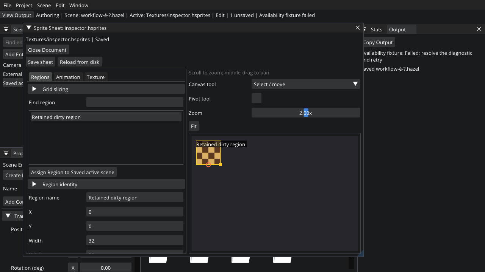

# Editor usability implementation: A1 / A2 and B–G

Baseline: `5de70c93a89e1c8df3fd37553569d9499f793c7a` on
`feature/sprite-sheet-authoring`, including the complete audit and descended from
`9a48282f59b4cbc188615ec66763c448b70a2e83`. Implementation branch:
`feature/editor-usability`. This record supplements
[the audit](editor-usability-audit.md). A1/A2 and their corrections are complete;
Stages B–G and their verification are recorded below. Optional H and broader tooltip cleanup remain separate stages.

## Workflows

- **Properties:** select an entity in Scene Hierarchy. Labels sit left of
  controls, vector axis buttons reset owner-supplied defaults, and Tab / keyboard
  editing use ImGui navigation. Angles display degrees but remain radians in
  components. Script fields without overrides explicitly show an unknown C#
  default; creating a zero/unassigned override is deliberate. “Use C# default”
  removes the override, without pretending the constructor was evaluated.
- **Assets:** Content Browser always exposes Import Texture, Search / Clear,
  type filter, breadcrumbs and Refresh. Search includes descendant assets;
  unfiltered browsing follows the current folder. Entries sort folders first,
  then case-insensitive paths with a deterministic tie-break. Click selects;
  double-click or Enter opens. Asset inspection retains the scene entity as the
  assignment target. Existing validated drag payloads continue to work.
- **Import:** choose the image, project destination and optional sheet path.
  If copying succeeds but sheet creation fails, the dialog says the image was
  imported, preserves its destination, and offers Retry Sheet Creation or
  Finish with Imported Texture. Retrying does not copy the image again.
- **Sprites:** open a sheet, select/name a region, edit bounds/pivot and sampling.
  Regions and animations have separate searchable lists. On Animations, choose
  the region in “Add frame”; each frame has its own region chooser, duration
  in seconds and reorder/remove actions. Preview transport and scrub operate
  independently of gameplay. Select Lantern in Scene Hierarchy: assignment
  says “Assign Region to Lantern” / “Assign Clip to Lantern”, or “Save Sheet and
  Assign …” when dirty. Saving must succeed before asset resolution and assignment;
  the captured scene/entity identity is revalidated. Sprite/clip inspectors offer
  Open Sheet and Reveal Asset. Invalid path text remains a draft; resolution is
  triggered by commit, explicit refresh/selection, browse or drop.
- **Save:** focus Viewport / Scene Hierarchy / Properties for scene Save, Prefab
  Inspector for prefab Save, or the sheet window for sheet Save. Ctrl+S and File
  > Save use the retained active document; the shell displays its name and `*`.
  Ctrl+Shift+S / Save As is scene-only under existing serialization contracts.
  Prefabs and sheets save in place; copying with new identities is deferred.
  Ctrl+Alt+S / Save All lists dirty documents and independently saves them.
  Partial failures and cancelled Save As identify each outcome, preserve failed
  drafts, and retry only documents that remain dirty.
- **Play / Simulate:** the current scene draft runs in a copy. Open prefab/sheet
  drafts are conservatively listed because scripts can select assets dynamically.
  Save Assets and Play / Simulate saves them first; Use Saved Assets keeps their
  drafts intact. Authored mutations are disabled during runtime. Saving the
  retained editor scene remains available. Stop returns to its retained selection.
- **Export:** Save All and Export or Export Saved Files (Keep Drafts) is explicit.
  Export never calls a discard path. Tool jobs protect scene and asset mutation,
  saving, replacement, script editing/reload and new tool jobs. Browsing and
  independent previews remain available. Apply-time checks share the same policy
  as menus, buttons, shortcuts and drop handlers.
- **Open / Close:** guards list only affected document types. Discard applies
  after successful replacement/close; failed or cancelled Open retains the old
  valid session and drafts. Closing a document actually releases it. Hiding a
  sheet window preserves its document; Window > Sprite Sheet reveals it again.
  Existing repair/schema behavior is retained for the later recovery milestone.

## Boundaries and ownership

`UI/PropertyUI` provides responsive two-column tables, stable explicit property
keys under owner identity scopes, tooltips, inline validation, disabled reasons,
read-only/reference presentation, resets and changed/committed results. Controls
contain no services, serialization, logging or writes. Discrete selections/reset
commit immediately; continuous/text edits commit on deactivation. Vector controls
stack axes in narrow columns. Owners hold picker drafts/caches and reset them on
entity, project, document, reference or asset-epoch changes.

`Authoring/EditorActions` owns action availability. `EditorDocuments` owns bounded
Scene/Prefab/Sheet guard intent, identities and per-file results; it has no ImGui
or I/O. `DocumentController`, `DocumentUI` and `EditorShell` contain controller,
modal and shell responsibilities respectively. Existing asset, prefab, tool and
atomic-file services retain their contracts.

In-memory dirty snapshots preserve authored path spelling without filesystem
canonicalization; saved-file serialization still uses its existing portable-path
contract. Project file-choice scans and recent-project existence checks occur on
explicit refresh/open, rather than every draw. No asset database was introduced.

Native decorations and OS behavior remain. A narrow Window title API publishes
project/scene identity on Linux/Windows. Existing docking IDs and layout files are
retained; no new default arrangement overwrites user layouts. Automatic diagnostics do not steal keyboard focus; shortcut ownership is queried
after all panels draw. The viewport toolbar contains only runtime icons; File, Scene
and Project menus retain saving, entity creation, script builds and export. Colors and spacing are restrained;
renderer facts are read-only and disclosed under an expandable section.

## Verification and human acceptance

The branch adds bounded Linux/Windows Debug and Release CI, using two compiler
jobs and existing ownership, serialization, renderer and runtime regression
executables. Release runs the OpenGL 4.1 profile. The editor smoke checks failed
assignment saves, stale targets, rejected Open, active saves, tool-busy mutation
rejection and invalid physics simulation before Box2D initialization. Pure document
checks cover scopes, save failure/exception/cancel, partial success/retry, explicit
Use Saved retention, true close/discard and action availability. The existing short
render/startup/shutdown test exercises focused ImGui shortcut delivery and fresh-row
control width. The legacy standalone renderer fixture now requests the engine
minimum (4.1), uses GLSL 410 with equivalent explicit UBO binding, and retains all
render/readback assertions. Optional
`HAZEL_EDITOR_CAPTURE` writes a screenshot from that smoke without image assertions.
The milestone workflow does not invoke automated game playthroughs or pixel-click
scripts. It retains existing service assertions.

Human acceptance remains necessary; automated evidence does not establish physical
mouse/keyboard usability, Windows DPI or native dialogs:

- Edit each component/script field with mouse and keyboard; reset defaults; type
  invalid reference drafts, then correct them. Check radians and C# default semantics.
- Select rows, clear by clicking only blank list space, type W/E/R/Delete in fields
  without invoking commands. Inspect an asset while retaining the scene target.
- Search / clear / filter assets, navigate breadcrumbs, import a texture, open it;
  exercise partial sheet creation and retry.
- Slice/name/pivot the bundled Lanterns sheet; add frames using their own chooser,
  change duration, reorder/remove, preview and scrub. Assign to a named entity.
- Ctrl+S independently saves scene, prefab and sheet. Scene Save As cancellation
  retains the draft. Save All partial failure preserves unsaved documents and reports
  exactly which saves succeeded.
- Play / Stop and Export with dirty documents: Use Saved keeps drafts; Cancel does
  nothing; destructive Open discards only after a valid replacement. Failed Open
  preserves the prior valid scene and asset drafts.
- Attempt scene/prefab/sheet edits, assignment, reload and saves during a tool job;
  verify reasons and unchanged inputs. Browse/preview and completion remain discoverable.
- Resize narrow panels and test Windows DPI / native snapping; restart to verify
  the existing layout has survived. No new layout persistence behavior is claimed.

This capture replays the existing ImGui draw data into a test-owned framebuffer;
its controlled failed operation is intentional. It excludes OS decorations and
is not evidence of physical input or Windows DPI acceptance. No matched baseline
capture was made. Assignment now precedes detailed properties; region identity is
an expandable section. The UI font retains its existing glyph coverage (the
fixture filename's emoji uses a fallback glyph); UTF-8 file identity is preserved.

## Focused correction after Linux/Windows feedback

This correction starts from `9868b17` on `feature/editor-usability`, including
the completed guarded recovery-retry fix and its regression coverage.

The runtime toolbar restores Hazel's existing Play/Simulate/Stop/Pause/Step icons,
with Play as Resume while paused. It retains `##toolbar` and the current docks;
authoring actions remain in File/Scene/Project menus, without a More dropdown.
Icon and menu commands share `InvokeRuntime`, existing availability checks,
dirty-asset guards and runtime lifecycle. Active document/dirty/tool status remains
in the status row and native title.

Shared vector rows restore attached red X, green Y, blue Z reset buttons, with
purple W for generic four-component vectors. Rows use all axes horizontally when
there is room, then fewer axes per line to preserve readable numeric fields.
Narrow scaled controls remain left-labeled. Defaults come from owners; reset commits
intentionally, `Changed` reflects a value change, and no supplied default means
reset unavailable. Engine rotations remain radians; inspector values are degrees.
Sprite pivots use the same vector helper with their known center default.

**Hazel source SDK** means a prepared checkout containing `premake5.lua`,
`scripts/hazel.py`, the canonical internal authoring/packaging/child-tools/template
files and `scripts/internal/toolchain.json`, pinned Premake under
`build/tools/premake-core/bin/release`, and host Debug `Hazel-ScriptCore.dll` under
`bin/Debug-<platform>-x86_64/Hazel-ScriptCore`. It is used by current New Project,
Build Scripts and Export; native Create Script, content editing/saving and a
prepared project's Play do not need it. Open still has its existing asset/assembly
requirements; this correction does not implement uncompiled-project loading.

Native `HazelSDK` discovery has a fixed order:

1. Explicit absolute override; invalid/moved/incompatible overrides report an error
   and remain persisted until deliberately corrected or reset.
2. Optional `hazel_sdk` string in `build.json` beside the executable. Absolute paths
   stay absolute; relative locators resolve against that metadata directory. A
   malformed/stale locator reports a problem. Current runtime packages **omit** it
   and contain no SDK; metadata without a locator stops development-layout inference.
3. The exact development `bin/{Debug,Release,Dist}-<host>-x86_64/{Hazelnut,MigrationEditorSmoke}`
   executable layout. No cwd dependency, ancestor search or drive scan.

`SDKSelection` keeps Not configured/Missing/Incompatible/Ready, effective root,
source and diagnostic outside preferences. Premake supplies expected tool pins
from the existing canonical manifest; validation checks required files and matching
Premake/PyYAML pins. This is SDK-file readiness, not comprehensive managed ABI or
host compiler validation: existing loaders and canonical preflight retain those
checks. A new comprehensive compatibility stamp remains stage E. Workers revalidate
SDK inputs before commands. SDK discovery starts no Python process; legitimate
Python discovery/preflight/build/export keep their existing contracts.

Preferences explain the SDK, show effective root/source/status and offer Browse,
Validate / Refresh SDK, and Use Automatic. Reset changes only the draft; Apply and
Save explicitly persists a blank override, never an automatic machine path. Invalid
text stays editable; checks run on commit/browse/refresh/apply/action, not each frame.
If discovery fails, select a compatible source checkout (not the executable or
Resources folder): clone with `--recurse-submodules --branch feature/editor-usability`
(the current compatible authoring branch; master lacks these tools), install README prerequisites,
then run `scripts/setup.sh` or `scripts/setup.ps1`. Check Readiness verifies Python,
Mono/.NET targeting packs and, for export, native compiler prerequisites.

The editor regression covers native discovery with spaces/Unicode/unrelated cwd,
prepared/unprepared and incompatible files, explicit precedence, package locators,
no-SDK packages, reset/persistence scope and owner-defined axis resets. Runtime
commands retain lifecycle/paused-Step and dirty-document Cancel/Use Saved assertions.
The recovery retry regressions remain intact. A bounded ImGui contract draws wide
and 300-pixel, 125% vector forms; capture is inspection evidence, not physical
mouse, Windows DPI or hardware acceptance.

Local validation passed: Premake Debug/Release builds with two jobs; all fourteen
sequential regressions in Debug/software and Release/OpenGL 4.1; native HD4000
editor startup/render/shutdown, including the 1024×640 capture. Capture fixtures
use viewport-relative positions inside isolated resources/data; existing layout
and preview-cache assertions remain intact. Physical input/DPI acceptance is pending.

**Pending tooltip cleanup:** audit redundant label/value tooltips across panels in
a later presentation pass. Keep explanations of behavior, units, shortcuts,
consequences and disabled reasons. Show the full value/path only when its visible
presentation is clipped; do not repeat already readable text. Touched runtime/reset
controls follow this policy, and status identity now gets a tooltip only when clipped.
No project-wide tooltip rewrite is included here.

## Stage B: Console and tool-operation reporting

Baseline `871028315416385975459bbefdc05b607707447c` on the existing
`feature/editor-usability` branch includes the completed recovery retry fix,
SDK discovery, compact runtime toolbar, colored vectors and the newer Skybound
pipe correction. The unrelated local MeadowRun Lanterns sheet is preserved.
No dependency, layout template, example, SDK generation or schema changes are
part of Stage B.

- **View > Console** replaces Output. Only the old panel's window settings are
  migrated in memory if Console has no existing settings; dock geometry/order
  and all other layout entries remain intact. Initial placement uses the former
  Output/Stats dock. Errors never open/focus the Console automatically; the
  document/status row has a visible error/result link. Explicit View/status clicks
  reveal the Console tab; background failures do not request focus. Runtime icons
  are unchanged.
- **Messages:** Core, App, Managed, Authoring, tool stdout/stderr and tool status;
  severity/source filters, substring search, Reset filters, visible/hidden/drop
  counts, Ctrl-select/keyboard selection, context Copy message, Ctrl+C,
  Copy > selected/visible, Clear, Auto-scroll and Latest. Summary rows
  are clipped; selected details wrap full multiline text/paths. A narrow panel
  uses a compact source/severity/message row. Settings explains native capture
  versus display filtering; capture defaults to Info and saves only on request.
- **Operations:** immutable ID/project-generation/request snapshot, actual
  Python selection, SDK/command, real CLI child-command stages, elapsed/start/end
  times, outcome/exit code and accepted artifact location. Operation details offers
  message filtering, Copy result and Open output folder through the existing
  native abstraction. A build records its module; export records its destination.
  The latest failed/cancelled/timed-out result remains pinned until Dismiss failure,
  even after clearing messages, history eviction or later successes.
- **Limits:** 1 MiB/1,024 incoming records; 8 MiB/10,000 retained records;
  64 KiB UTF-8-safe individual records and partial lines; 20 operation records
  plus one pinned failure. Pump moves at most 256 records/256 KiB per frame.
  Oldest messages drop with explicit counters. Clear atomically removes accepted
  queued and retained messages and resets counters; new messages may arrive
  afterward. It does not cancel work, reset sequence IDs or erase operation results.
  Process final reports retain at most 2 MiB; result details preserve the final
  64 KiB so compiler failures at the end remain useful.
- **Lifetimes:** Hazel owns a permanent distribution sink, preserves stdout and
  any separately attached sinks, and offers scoped weak observers. Hazelnut's
  data-only session precedes Application construction and outlives its teardown.
  Observers detach after tool/watcher/script/renderer shutdown; Reset waits for
  in-flight bounded ingestion. No worker/sink calls ImGui or owns editor/scene
  pointers. Sink recursion is suppressed and collector locks never call logging.
- **Tools:** one worker, separate fair stdout/stderr reads, bounded drain passes,
  original interpreter/SDK/preflight contracts and argv execution. The canonical
  Python invocation explicitly enables UTF-8 text output on both platforms. Poll validates
  project path and generation before typed main-thread reload/open actions. A narrow
  Application main-thread callback keeps polling while minimized, without advancing
  scene/runtime/render updates; editor detach and Application teardown clear it. Stale
  completion is labeled Previous project. Normal close waits and offers Keep editor
  open. Internal forced teardown cancels, terminates the owned Linux process group /
  Windows job and joins; it never applies an editor action. Windows children inherit
  only their three standard handles. Python discovery's existing probe is bounded
  by five seconds; normal jobs retain the sixty-minute deadline. No unsafe
  interactive compiler/export cancellation button is introduced.

Focused checks exercise the actual relay, mixed sources/order, filtering/copy,
UTF-8 truncation, bounded inbox/Pump/retention/Clear, pinned completion across
truncation/history eviction, observer recursion/concurrent teardown, stdout/stderr,
continuous-output deadlines, consumer exceptions, failed/cancelled workers,
project/generation rejection and descendant cleanup on cancellation/shutdown.
Existing failed Open, Save-and-Assign, document-operation and runtime guard checks
remain intact. The real editor smoke checks Output-to-Console dock migration and completion
while minimized without advancing scene/render frames.
Local validation: Premake Linux Debug and Release builds with two compiler jobs;
all 14 canonical regressions in Debug/software and Release/gl41 passed. An isolated
software-rendered editor capture was inspected at 1024×640 with a 300-pixel Console
at 125% scale; controls wrap and messages use compact summaries with full details
on selection. This is not physical mouse/monitor or Windows DPI acceptance.
The existing Linux/Windows CI workflow is required for the pushed revision.

Hands-on Linux/Windows acceptance: open Console from View; filter/search and copy
multiline diagnostics; scroll upward during a build and use Latest; make a script
compile fail while Console is hidden and verify the status link does not steal a
text field's focus; inspect the failure, Clear messages and build successfully,
then confirm the old failure remains until dismissed. Export and open its output
folder; request close during a job and choose Keep editor open. Check a narrow
Console and scaled Windows UI. These are acceptance tasks, not claims of physical
mouse/DPI verification.

**Stage B limits:** existing NativeLog calls and managed exception logs are tagged;
arbitrary C# Console.Out/Error remains stdout and is not advertised as captured.
A public managed logging facade/domain-scoped redirection, optional rotating native
files and validated compiler file/line navigation remain later Console refinements.
All messages/result details can be copied, and artifact folders can be opened now.
Broad redundant-tooltip cleanup remains explicitly pending as recorded above.

## Stage C: normal Open and preservation

Baseline: `bde96f27494fa0c5732c6bc72d6107e4a99e856a` on
`feature/editor-usability`. This checkpoint keeps the existing Console, guards,
SDK discovery, runtime icons, colored property controls and recovery retry path.
C was paused for a reboot; delivery resumed before D/E on 2026-10-05.

Normal Open Project/Scene now stages the accepted bytes, strict known schema,
scene/resources, browser and optional managed domain before replacing the session.
Scene candidates use a temporary asset cache; only accepted Open refreshes the shared
cache, so repaired sheets retry successfully without failed Open changing current caches.
The separate “for Repair” menus are removed. Structured results distinguish Ready,
Editable With Problems, Needs Decision and Rejected. Missing textures/sheets/IDs
retain authored references; malformed/duplicate/unknown/future data is rejected.
Missing startup scene/assets offers explicit Locate or Workspace Without Scene
in Console. No arbitrary replacement is chosen or descriptor rewritten by Open.
Present invalid assemblies reject Open; missing assemblies permit editing and
retire the previous project's classes while keeping Mono's root reusable. Scripted
Play still requires valid classes; non-scripted Play and validated Simulate remain
available. Build/reload uses the existing staged replacement path. Unassigned Script components
are script-free for startup; assigned classes still require a valid domain. Tool requests
and completion follow-up reject an externally changed accepted project descriptor.

Console owns actionable Open findings: original file, diagnostic copy, guarded
Retry, affected-entity selection and resource/recovery folders. Findings describe
Open, rather than claiming continuous validation while the user types. Pending
operations and apply-time policies still govern replacement. Failed/cancelled
Open retains the scene, prefab, sheet, selections and dirty drafts.

FileDocument retains bounded accepted bytes and detects external replacement,
deletion and unreadable-source conflicts before scene/prefab/project/sheet saves.
Conflict choices retain both versions: exclusive Save Copy, guarded Reopen, Cancel.
Project Settings offers a descriptor-form copy without changing the active session;
place it beside the original to keep relative assets meaningful. Scene Save As keeps
its supported native overwrite contract; conflict Save Copy never overwrites.
No YAML merge or silent overwrite of an observed conflicting version is attempted.

Known legacy/default changes are reported before Save. Scene writes SceneVersion 1
and preserves its actual name; missing texture paths never become permanent
placeholder data. Legacy sheet Filter/sampling/list/pivot/loop defaults are visibly
identified. Before a recovery/migrated overwrite, exact original bytes go to
`UserData/recovery`, with source path, byte count, UTC epoch time and an FNV-1a-64
fingerprint. Retention is 20 originals / 128 MiB; source reads are capped at 64 MiB.
Backup failure prevents the source write. Atomic sibling replacement is preserved;
this is neither a multi-file transaction nor a guarantee against an external writer
racing the final check/publication. Periodic unsaved-draft recovery remains deferred.

Unresolved known scene/prefab references can be saved and reopened. Runtime keeps
its existing required-resource validation; packaging validates the dependency closure
strictly. Sheet saves retain existing
texture/dimension validation, so a missing texture needs explicit correction before
saving its metadata. Native packaging validation now gates descriptors using the
same ProjectSerializer and rejects future/unknown fields. Normal scene loading rejects
prefab metadata it cannot write back; the explicit prefab reader retains that contract. Exclusive prefab creation
closes the destination race without changing detached prefab semantics.

Local verification (2026-10-05): canonical Premake `build --config Debug --tests`
and `build --config Release --tests` passed with `make -j2`. In both configurations,
SceneFoundationSmoke (including production EditorDocuments guards/recovery/cache
ownership), ProjectPhysicsSmoke, MonoSmoke, SceneSmoke (staged domain cancellation,
stale tickets, shutdown and unassigned-script startup) and ShaderToolsSmoke passed.
Native SpriteAssetAudit fixtures accepted supported data and rejected future project,
unknown project and future scene data without changing sources. Existing authoring/tool-boundary
regressions passed, including script builds without PATH and failed
publication preservation. Python compilation and whitespace checks passed.

After reboot, unrestricted local verification reached rendering: the canonical Debug
software suite passed its first 13 executables; EditorSmoke exposed a fixture with
no assigned scripts in its missing-assembly case. That fixture now includes an
assigned class. Rebuilt Debug and Release editor regressions passed, including
production Open/cache recovery, retry, all three dirty documents, Save-and-Assign
and runtime toolbar/lifecycle coverage. Release used software OpenGL 4.1. These
are software-rendered checks, not physical desktop/DPI/GPU acceptance. Git/network
access is restored; CI is not awaited, per the user's updated instruction.

Hands-on C acceptance (Linux and Windows):

1. Keep scene, prefab and sheet drafts dirty. Cancel normal Open, then try malformed
   or future files with Discard on Success; verify every old draft/selection remains.
2. Open a copy with a missing texture or broken sheet reference. Edit, Save and reopen;
   inspect the retained path/ID and original recovery copy. Play/export must fail
   actionably until references are explicitly fixed.
3. Change the source externally while a draft is open. Save must retain both versions;
   exercise Save Copy, cancelled Reopen and successful guarded Reopen.
4. Open a project with its managed DLL absent. Content editing/scene Save and
   script-free Play/Simulate remain possible; unavailable scripted Play reports why.
   Restore/build the DLL and reload; failures retain the previous valid domain.
5. Open a project with missing startup scene/assets. Use Locate or explicitly choose
   Workspace Without Scene; the descriptor changes only on an explicit settings Save.
6. Retest the completed dirty-sheet recovery Retry Open and Save Sheet and Assign
   paths. Check Console diagnostics and the small-window conflict dialog.

## Stage D: editor state and device information

D follows C (`21bd078`) on the same feature branch. Settings retain the existing
user-data location and `imgui.ini`; native decorations and renderer initialization
remain unchanged.

| Owner / location | Values | Write trigger |
| --- | --- | --- |
| Editor preferences / `preferences.yaml` | Explicit tools, UI scale, collider overlay, capture admission, recents, reopen toggle, editor-window VSync | Apply and Save; discrete capture/recent changes. Native lock plus accepted-byte conflict check. |
| Machine session / `session.yaml` | Normal window rectangle and DPI hint, maximized flag, last successful project, hierarchy/properties/browser/stats/Console visibility, Console filter/search/follow | Changed state polled at 0.5 s, written after 1 s settled; successful transitions and guarded close flush. |
| Project workspace / `workspaces/<canonical-path-FNV64>.yaml` | Last accepted scene, camera orbit, valid selected UUID and component sections, browser folder/search/type/tile size, sheet/region/clip and prefab presentation, export folder/name | Same settled-state / project switch / close triggers; relative references where possible. |
| Dock layout / existing `imgui.ini` | ImGui dock IDs, ordering, detached panels | Existing detach save. Only unreachable detached hosts are repositioned; no default dock rebuild. |
| Secondary instance / `instances/<token>` (layout uses the same token) | Session/workspace/layout snapshots | Shared session/layout lease held by the primary; secondary instances do not overwrite it. Snapshots can be inspected in the editor data folder. |
| Portable project / content | Existing descriptor and authored data | Document/project Save only; no machine geometry, paths or preferences added. |

Only windowed normal geometry and maximized state restore; minimized/fullscreen,
Play, simulation, animation time, live fields, physics, jobs and operation filters
never restore. Window bounds fit a current monitor work area, account for native
frame borders, constrain small/offscreen rectangles, and keep normal geometry apart
from maximized geometry. UI scale follows the editor preference and current display
scale. Physical multi-monitor/DPI acceptance remains a human check.

Startup supports legacy project argument, `--project`, `--scene`, `--no-restore`.
Explicit bad input reports failure and cannot fall back to remembered/bundled
content. After a successful startup project stage, a remembered scene is tried;
failure retains the validated startup scene and offers Locate/Forget. Manual
project opening keeps the descriptor startup contract; the remembered scene has
an explicit normal guarded Open route. Missing project offers File > Locate /
Recent / New. After Locate, previous workspace association is explicit, never
inferred from display names. IDs, folders and document selections are validated;
asset-document restore defers while another operation is pending and never replaces
an independently opened draft.

Settings have version/unknown-field/range gates, 128 KiB workspace/session limits,
atomic writes and accepted-byte conflict checks. Malformed/future files remain
untouched until explicit reset with original backup. Oversized originals require
moving them aside explicitly. Reload session baseline and Reload saved preferences
resolve external editing conflicts without touching authored drafts. Preferences
use a short native lock; session/layout ownership uses a process lease, released
on teardown/crash and excluded from child processes. Secondary snapshots are
separate recovery data; automatic selection/retention of old instance snapshots
is not a replacement session restoration mechanism.

Preferences use General/Tools/Graphics categories with category/settings-name
search, Apply and Save, Revert and Reset. Graphics shows the existing API/device/
version/capability record only; sample limits do not enable multisampling. Editor
VSync changes only the current editor window and is not a portable renderer policy.
Broader tooltip cleanup, renderer policy controls and hierarchy remain separate.

Verification: Linux Debug/Release Premake builds and five CPU suites pass. The
production startup regression checks remembered scene/camera/selection, bad explicit
input retaining content, missing-scene fallback, no-restore and workspace reset.
Release software OpenGL 4.1 editor regression passes, including prior C/retry/
Save-and-Assign and compact toolbar coverage. Logical regressions exercise primary/
secondary snapshots, locks, future originals and concurrent preference conflicts.
Physical monitor removal, Windows DPI and desktop acceptance remain unverified;
Windows CI is not awaited per instruction. User files/stash/vendor preservation
still matches the snapshot.

## Stage E: native creation and authoring readiness

E follows D (`9e4f585`). `ProjectCreation` is the canonical native generation
service, shared by Create and Open and the `HazelProject` CLI. Display name,
identifier, destination and template version are validated before exclusively
reserving a sibling staging directory. Descriptor/native scene metadata, source,
directories and build templates are checked before Linux renameat2 NOREPLACE /
Windows non-replacing directory publication. Failure cleans only the owned staging
folder. No compiler, interpreter, active-project mutation, Mono initialization or
GPU/font creation occurs in the generation service. Opening is a separate guarded
stage; generated files remain discoverable if subsequent Open fails.

One versioned resource template set owns Premake and Entity source. Create Script
and starter Example use the same native source service. Python `new-project`
delegates to the native frontend; it has no template or identifier fallback.
Compilation is optional (`--build-scripts`) and happens after publication, so a
failed compiler preserves a content-first project. Runtime packages contain the
editor's templates, not a full source SDK; the native editor can create without
Python or a source SDK. The CLI wrapper needs the prepared SDK's native executable.

Project > Authoring readiness distinguishes native editing/saving, script tools,
scripted versus script-free Play, and standalone export prerequisites. Missing
assembly keeps its intended module path; old classes are retired. Valid later
reload uses staged publication; failed compilation/reload retains the previous
valid domain and authored fields. Inspectors retain unavailable names/overrides
rather than inventing defaults. Scene/resource validation remains an apply-time
requirement; readiness does not promise arbitrary content is valid.

Authoring/template/native-generator/ScriptCore contract version 1 is separate from
engine commit identity. New descriptors carry AuthoringVersion 1; existing
unstamped projects are not rewritten. Future authoring versions reject Open. SDK
file discovery validates the resource stamp/native tools; Python preflight/build
probes native generator and managed ScriptCore marker; native domain staging and
packaging verify the same marker. Mismatch messages request matching SDK/rebuild.
Dependency pins are unchanged.

Export retains the canonical Python packager and deterministic tool discovery.
Its Premake request selects Nutella, ScriptCore, PackageAudit, SpriteAssetAudit and
HazelProject/dependencies, followed by the chosen project's Release scripts;
full developer builds remain available. No unrelated example build is requested
by export. Native descriptor schema validation precedes compiler/package parsing.
The descriptor startup scene and saved asset closure are explicit; dirty guards
can Save and Continue or retain drafts while exporting saved content.

Verification: Linux Debug/Release Premake builds with two jobs pass, as do the
14-executable software regression suites in both configurations. Final focused
Debug CPU/editor checks include incompatible templates, future authoring versions,
exclusive publication, native creation without Python/SDK, script-free Play,
later staged assembly publication and failed-reload retention. Release software
OpenGL 4.1 editor checks retain C/D, retry, Save-and-Assign, toolbar and Console
coverage. Native creation/CLI tests cover spaces/Unicode, no PATH/tool requirement,
later build and failed optional-build content retention.

A fresh native project's saved Release export passed the canonical packager's
managed/asset/native closure validation. Its log requests runtime/validator targets
and only the chosen project's scripts. Archive and extracted-file checksums,
no-symlink packaging and relocated headless Nutella CLI/invalid-input checks pass
from spaces/Unicode paths without SDK/resource overrides. No game playthrough or
physical GPU/DPI acceptance was performed. Windows CI is not awaited per instruction.
Final cross-platform review corrected PCH include ordering in the new native
creation/window/lease files; actual Windows execution remains a CI/human check.
Build/export prerequisites are explicitly checked at the operation; the existing
preflight snapshot may require checking again after another tool result.

## Stage F: renderer requests

Baseline `a0a4228` on `feature/editor-usability`; the unrelated Lanterns sheet,
A–E, native decorations, docking, dependencies and examples remain intact. Only
OpenGL is selectable by engine code; the UI offers no backend, MSAA/HDR, MaxQuads
or unimplemented quality choices.

`RendererPolicy` is the shared CPU validator/resolver over the existing backend
capability record. Resolution retains requested settings separately from effective
settings and reasons. `GetSettings()` now returns effective shader/debug/batch
policy; `GetResolution()` retains the request. Renderer2D exposes its actual quad
program-loading path, rather than inferring every shader's implementation from a
checkbox. Existing legacy/direct GLSL shaders remain unchanged.

| Request / access | Scope and persisted values | Application / effective result |
| --- | --- | --- |
| Runtime VSync, Project Settings > Runtime rendering | Portable optional `Project.Rendering` v1; On/Off, default On | Nutella submits 1/0 before renderer initialization. Hazelnut Play/Simulate submits the saved project interval; Stop restores editor preference. Driver/compositor timing is unmeasured. |
| Shader loading, same section | Portable Automatic / GLSLCompatibility; default Automatic | Initialization only. Auto uses core 4.6 plus loaded binary/specialization functions, otherwise shaderc/Cross to GLSL 410. Compatibility always uses GLSL. |
| Texture batch slots, Advanced batching | Portable 2–32 including white; default 32 | Initialization only, effective min(request,32,device texture units). Smaller batches can increase draw calls; no quality change. |
| Editor VSync, Preferences > Graphics | Existing machine-local On/Off preference | Main-window live in Edit; project interval wins during runtime. Detached ImGui windows retain their existing swap behavior, not a claimed global policy. |
| GL debug output, Advanced editor diagnostics | Machine-local Automatic / Off / On; Auto means Debug On, Release/Dist Off | Initialization only; effective request AND existing core-debug capability/entry points. Unsupported requests stay authored with reason. Console capture threshold is separate. |

Hazelnut reads native preferences and the Stage D launch/session selector before
Application creation. Explicit invalid arguments do not load remembered policy.
Missing/malformed/future settings remain preserved; ordinary Open retains its
existing diagnostics. Nutella obtains requests from its staged descriptor before
constructing Application. Both hosts use the same validator/resolver. Console
capture starts before CPU prelaunch and outlives Application teardown.

Project switching never recreates the renderer. Current and desired effective
GPU policies are compared; different shader/batch results show a restart reason
and disable Play/Simulate through shared availability and engine apply-time
validation. Equivalent effective policies need no restart. Save wanted documents,
close through the existing guard, and relaunch that saved project. Runtime start
rejects incompatible policy before retiring a valid session. Resize/Stop leave GPU
policy unchanged. Diagnostic preference changes show current capture and pending
restart; no live shader/callback/resource replacement is attempted.

The versioned `Rendering` block rejects unknown fields/versions and invalid values.
Omitted blocks preserve legacy defaults without being automatically added on an
unrelated save. Known omitted fields inside v1 are visible default migrations,
with original preservation before overwrite. No device facts/effective results are
serialized. Packaging copies the descriptor unchanged and uses native schema
validation; an older source SDK that rejects Rendering needs updating/rebuilding,
not a Python fallback or silent field removal.

**Save rendering requests** atomically updates only the accepted descriptor/config,
retaining scene/prefab/sheet drafts and other Project Settings drafts. Conflict,
pending document operation, runtime or tool-job rejection leaves them unchanged.
General Project Settings keeps its existing guarded stage-and-reopen contract.
Property rows show requested drafts, availability, current program/batch/interval
and limitation/restart reasons. Device details remain in Stage D's Graphics group;
Copy Device Report copies that record and policy to clipboard/Console. Preferences
inspection/graphics saves do not launch Python; explicit tool checks remain native
UI actions over the established tooling.

Verification: Linux Debug/Release Premake builds (two compiler jobs) and both
canonical 14-executable software-rendered suites pass, retaining A–E coverage.
Focused cases cover capability fallback, invalid requests, project isolation and
unknown/future byte preservation, read-only prelaunch precedence, failed save and
runtime replacement, retained three-document drafts, and submitted VSync intervals.
Renderer checks retain color/picking readbacks and draw-count assertions with both
32-request/device-clamped and two-slot batches. Native accelerated Intel HD4000
OpenGL 4.2 renderer/editor checks pass; software OpenGL 4.1 editor/renderer checks
pass. Forced llvmpipe 4.6 additionally verifies actual SPIR-V versus generated GLSL
programs and debug-message capture enabled versus disabled.

The canonical export path packaged a saved project with VSync Off, two texture
slots and GLSL compatibility. Its extracted descriptor retains those requests;
relocated package validation and an actual packaged Nutella startup/render/OS-close
on HD4000 pass with interval 0 and effective batch 2 in the log. GLX observation
also reports intervals 1/0 on the native renderer check; neither observation
measures compositor timing. An isolated 1280×720 software capture drew the real
settings at 410/300 px widths and 1.25 UI scale; controls remain readable, with
wrapping explanations and scrolling. Screenshots and logs stay outside the repo.
An extra capture run concurrent with linking hit the existing synthetic-minimize
fixture's timing (a frame resumed while its probe job was still busy; Open was
correctly rejected). The idle repeat passes unchanged,
including minimized polling. No assertion was weakened; this is a remaining
fixture limitation, not hardware-minimize acceptance.

No GitHub Actions were queried or awaited. Windows build/execution, physical
keyboard/mouse/DPI interaction and perceived frame pacing remain acceptance checks.
The unrelated Lanterns draft, recorded layouts/preferences/VS Code files, stashes
and recursive vendor pins/clean worktrees were checked unchanged.

### F acceptance correction: normal F5 startup

Hands-on acceptance found F5 reopening SceneTransitions after saving Skybound.
The saved session correctly remembered Skybound; both development launch templates
supplied SceneTransitions as an explicit project argument, which correctly won over
restoration. Normal Linux/Windows Hazelnut F5 now passes no project argument;
Nutella keeps its explicit runtime example. Setup/README show normal restored launch
and explain intentional explicit overrides. The affected local Hazelnut args were
removed without changing other debugger settings or replacing the ignored config.
A production-path regression opens/saves a different project, flushes shutdown state,
reads fresh session/prelaunch state and verifies restoration; intentional explicit
launch still wins. Template checks run in the existing regression runner. Linux
Debug/Release Premake builds pass with two compiler jobs; native HD4000 Debug and
software OpenGL 4.1 Release EditorSmoke pass, including the new restoration case
and existing guards/recovery/Console/renderer checks. Python compilation and both
platform template checks pass. Physical F5/debugger interaction and Windows
execution remain acceptance checks. Older Windows local configs need only their
Hazelnut args set to []; ignored configs are not replaced by a pull. No Actions
query or further stage is part of this correction.

## Stage G: hierarchy and detached prefabs

Baseline `5bf8028`, with user-generated editor state and the unrelated Lanterns
sheet retained. First checkpoint introduces scene-owned parent UUID/sibling-order
records, derived ordered children, bounds (10,000 entities / depth 256), local TRS
and exact on-demand world composition. No relationship pointers or separately
persisted child list exist. Keep World defaults to validated inverse-parent TRS;
relative reconstruction tolerance is 2e-4, with singular axes below 1e-6 and
reflections/shear rejected rather than approximated. Keep Local is explicit.
Visual world matrices can contain shear. Candidate validation precedes publication;
root-only physics placement is enforced, including component addition.

SceneVersion 2 writes explicit parent/order; v1/unversioned files load as roots
and report a known migration before explicit Save with the existing original
backup contract. Unknown/future/malformed graph data rejects staged Open. Native
project creation's CPU-only Welcome DTO now records its root relationship.
Subtree deletion is child-first; Delete Parent/Keep Children detaches atomically
with the chosen transform policy and is Edit-only. Runtime parenting is bounded
(256 queued, 128 completed results), validated at request and lifecycle commit;
getters retain committed relationships until then. Consumers, subtree remapping
and the tree/prefab authoring UI follow in subsequent checkpoints.

Checkpoint verification: Premake Linux Debug build with two jobs and production
SceneFoundationSmoke passes, including model transforms, ordered traversal,
cycle/cross-scene/singular/shear rejection without mutation, graph save/reopen,
legacy/future retention, independent scene copying, deletion policies and root
physics placement. Existing document/settings/recovery/native-generation checks
pass. No Actions query or physical UI acceptance is claimed.

Integration checkpoint: rendering, text/circles/sprites, cameras, mouse-world input,
selection outlines and world-space gizmos consume composed matrices. Gizmos refuse
world shear/reflections/singular poses before ImGuizmo can approximate them;
local properties remain available. Collider overlays match root fixture offsets
(unscaled, rotated by the body) and circle radius from uniform XY scale. All
rigidbody/collider owners remain roots; positive XY dimensions, planar X/Y angles
and uniform circle XY scale are validated by the shared scene service at component
addition/replacement, transform edits, deserialization, runtime and export. Runtime
fixture scale is immutable; position-only managed edits retain exact authored
rotation/scale instead of round-tripping them through decomposition.

Existing managed Translation/Scale remain world-compatible (roots retain exact
local values; nested Scale requires representable world TRS). Explicit local
translation/rotation/scale, exact WorldMatrix, Parent, snapshot Children and queued
SetParent/Detach with Pending/Applied/Rejected/Expired results are additive to ABI
contract v1. Parenting commits at lifecycle boundaries even while paused; getters
read the committed graph. Subtree destruction invalidates every member immediately;
cleanup and Stop visit children before parents, with existing snapshot callbacks.
Scene hierarchy operations require the owning thread.

Subtree duplicates allocate all IDs, remap internal entity fields and relationships,
retain explicit same-scene external fields and insert beside the original.
Detached prefab v2 has PrefabRoot and one connected subtree; creation rejects
external entity fields/native factories and never guesses a same-UUID target.
Instance IDs/fields are fully staged before insertion; rollback retires only new
owners. Repeated instances are independent. Position-only placement retains root
rotation/scale; initial placement retains the existing finite/positive-scale
contract. v1 single-entity assets remain readable; explicit Save writes v2 and
preserves original bytes. Child selected for creation preserves world placement
only when exact detached root TRS is representable. Asset paths remain owned by
the destination project; no nested automatic instantiation or live links exist.

Export uses the same scene deserializer with a CPU-only metadata resource option
(including null default font ownership), then the existing canonical asset decoder
and inventory closure. It does not create a second graph/physics reader or require
GL to validate content. Packaging's entity-reference inventory accepts internal
subtree IDs rather than just self; native validation gates the connected graph.
Native project generation remains CPU-only with the v2 root DTO.

Integration verification: targeted Premake Debug build passes with two jobs;
SceneFoundationSmoke/SceneSmoke pass actual remapping and managed ABI/lifecycle
checks. SceneGPUSmoke passes nested sprite/camera pixel picking and root-body
visual descendants on accelerated HD4000 OpenGL 4.2 and software OpenGL 4.1,
alongside existing rendering/reload/shutdown assertions. Native RuntimeSessionSmoke
passes retained-session/transition coverage. Native CPU closure checks accept v2
internal refs/child textures and reject external/self-cycle data without rewriting.
The serialization fixture now uses valid planar/uniform-circle physics; corrupt
transition data is written explicitly because serialization correctly rejects it.
No assertions were weakened and no Actions query or physical UI acceptance ran.

Editor checkpoint: Scene Hierarchy is an expandable UUID-scoped tree with
ancestor-aware name/component/class search, arrows only for parents, reliable
row/blank selection and F to reveal/frame the selected world position. Create
Root/Child, context-menu Duplicate Subtree and counted Delete confirmation share
apply-time availability checks. Drag/drop and Properties Parent default to Keep
World; Shift-drop or the explicit Keep Local choice intentionally keeps local
values. Stale/cross-scene targets, cycles, physics and nonrepresentable transforms
produce an inline reason and Console diagnostic without changing selection/data.
Delete Parent/Keep Children is explicitly available only for authored scenes.

Properties display local transforms using the existing colored vector controls;
rotations still display degrees/store radians. World position and an expandable
read-only matrix aid diagnosis. Existing world gizmos/picking and scene/UUID
selection are retained across Play/Stop. Prefab Inspector embeds the same tree
and local Properties with a static subtree preview; it neither runs scripts nor
physics. Its sole root cannot be detached/deleted/duplicated into disconnected
roots; child subtrees can be edited. Creation/saving/assignment, snapshots, conflict
checks and document guards continue through the established controller/services.
Window/docking IDs, native decorations and compact runtime toolbar are unchanged. Deletion never guesses replacement references. A detached prefab Save
rejects stored entity references outside its remaining subtree and identifies the
field; clear/reassign explicitly before saving, retaining the draft and prior file
on failure. Unavailable script classes expose their stored entity references with
Clear (an explicit unassigned override); constructor defaults and other stored
fields are not evaluated or changed.

Hands-on acceptance: create a root and nested sprite child; compare local/world
positions; drag with/without Shift, try a cycle and a sheared Keep World move;
add physics to a child (rejected) then to a root with visual children; duplicate,
confirm/cancel subtree deletion; create/save a subtree prefab, edit a child and
instantiate twice; reopen the scene and exercise Play/Stop selection. Check small
panels and Windows DPI. These remain physical user acceptance, not automated
mouse-driving results.

Final G verification: Linux Premake Debug/Release builds pass with two compiler
jobs. All 14 sequential regressions pass in Debug native and Release GL4.1
profiles. Focused native Debug and software GL4.1 Release editor checks pass after
stabilizing the existing synthetic-minimization fixture against delayed real
configure events; no-update, timeout, completion and availability assertions stay
intact. Native HD4000 reports OpenGL 4.2; software scene/editor GL4.1 checks pass
world rendering/picking and preview lifetime assertions. The optional 1280×720
capture was inspected at 1.25 scale with 300/330-pixel tree/Properties panels.

Canonical export from a fresh native-generated temporary project builds its
scripts and validates the complete v2 subtree/internal-reference/child-texture
closure. Archive hashes and exact scene/prefab/texture/descriptor bytes pass;
relocated headless validation and bounded native Nutella startup/render/OS-close/
shutdown pass without SDK/resource overrides. The omitted default rendering
block resolves normally (HD4000: requested 32 texture slots, effective 16).
User session/workspace updates made while running Hazelnut were retained; unrelated
Lanterns edits, layouts, ignored VS Code files, stashes and pristine vendor pins
remain untouched. No Actions query, Windows build or physical mouse/DPI acceptance
was performed. Optional H and broad tooltip cleanup await G hands-on acceptance.

## Deferred findings

Optional custom caption and broader tooltip cleanup remain later stages. Stage C adds recovery/schema gates
and prefab conflict/exclusive creation checks; the earlier A1/A2 scope remains as
recorded above. Save All is a
series of existing atomic file writes, not a multi-file transaction. Preferences
and project forms retain explicit Apply/Save rather than becoming document types.
Native project creation is independent of script tools; builds and exports retain their SDK/tool contracts.

Unrelated example edits, stashes, ignored VS Code configuration, user/resource
layouts and all recursively pinned vendor repositories are preserved; editor state
written by the user while running Hazelnut is retained. No merge into master or force push is part of this milestone.

## Final milestone: hierarchy correction

The Stage G engine/serialization/physics contracts are retained. Its initial UI is
superseded: one Add Entity creates scene roots (inside the sole prefab root when
editing a detached asset). Scene Root/Prefab Root stays above the scrolling tree;
row drops always mean inside that entity, never between siblings. Reparent and
root drops always Keep World; failure never switches to Keep Local. Source rows
are muted, proposed parents outlined, and the cue names the outcome. Edge scrolling
and delayed target expansion support longer trees. Properties retains components;
parent selectors, world/local toggles and matrix machinery are removed. Right-click
or Shift+F10/Menu opens compact parenting alternatives for keyboard accessibility.
Duplicate/delete/search and prefab containment remain guarded. Explicit Keep Local
remains an engine API, with no persistent editor toggle or Shift-drop override.

Before the Codex restart, checkout .git was read-only and GitHub DNS/API access failed.
Checkpoint commits are retained in /tmp/hazel-final/review.git against 52eb346;
source changes remain in the original checkout. Master must not be merged until
feature CI can run and pass. The native :0 display was inaccessible and Xvfb was not
installed; visual and physical drag/drop verification remains pending rather than
being inferred from CPU tests.

## Optional H: caption implementation

Native decorations remain the default. Preferences > General > Custom editor
caption persists an editor-only request; effective mode/reason are observations.
Windows 10+ with desktop composition can opt in to a per-HWND DWM bridge. The
engine Window API owns move/resize/maximize/minimize/focus/close integration;
Hazelnut supplies only client-coordinate drag/control rectangles and presentation.
Signed screen coordinates are converted by Win32, resize metrics use the window's
DPI, maximized bounds use the monitor work area, and stale rectangles clear on
size/DPI events. The drag area delegates to native HTCAPTION behavior (including
double-click and drag-to-restore); HTMAXBUTTON exposes Windows Snap hover while
click/capture cancellation uses the actual custom rectangle. Alt+Space and caption
right-click use the native system menu; GLFW keyboard-menu support is enabled.
F10 focuses the ImGui menu entry when text input is not active. OS close and the
caption Close both dispatch the existing document/job decision. The compact
runtime toolbar is unchanged.

The pinned GLFW titlebar implementation consults a global hint: changing it would
risk detached windows. This bridge modifies only Hazelnut's primary HWND and
restores its previous procedure/frame before destruction or native fallback.
Detached windows keep GLFW's native decorations. Linux retains native WM chrome:
the pinned X11 titlebar facility does not supply complete OS integration. Future
macOS remains native until a dedicated Cocoa integration exists. Unsupported DPI/
composition, lost composition, or insufficient width retain/restore native chrome
without overwriting the request. Apply in Preferences retries the request. Project,
active-document/dirty identity and operation status remain in the header/status/
native title in either mode. Clipped identity gets a full-value tooltip. Custom
ImGui controls do not claim native accessibility; native mode stays available.

Verification is bounded: CPU tests exercise control-versus-drag priority, empty/
invalid regions, scaled/negative coordinates, preference round-trip/reset, future
file preservation and concurrent preference conflicts. The existing actual editor
regression also calls Window::RequestClose on a dirty hierarchy and cancels through
EditorDocuments, asserting draft/selection preservation. That graphics regression
and Windows OS behavior require an accessible display/Windows runner; this session
cannot access :0 and has no Xvfb or Windows toolchain. No Snap, mouse, DPI or physical
GPU acceptance is claimed. Required feature CI remains a merge gate.

Session paused at the user's request before H verification completed. The hierarchy
correction has a verified CPU/Debug checkpoint; caption changes are a separate WIP
checkpoint, not a completed H acceptance. The full Debug build was still running
at pause, and new caption tests, Release, desktop capture, Windows/feature/master
CI and tooltip cleanup remain outstanding. Master is unchanged. A restart-safe
bundle is stored in ignored build/review for importing the local checkpoints once
normal Git access returns; unrelated example edits are excluded.

H resumed verification: Git/GitHub and the native display are available after the
Codex restart; both retained checkpoints were imported without changing unrelated
files. Linux Premake Debug builds and all 14 native regressions pass on HD4000
OpenGL 4.2. Caption CPU and production hierarchy-drop checks pass. The isolated
300/330-pixel, 1.25-scale hierarchy/Properties capture was inspected: root target,
Add Entity, tree indentation/selection and vertical colored vector fallback are
visible. This is render/layout inspection, not physical mouse acceptance. Compact
ColorEdit numeric fields remain a pre-existing narrow-panel limitation, outside
this correction. Caption separators use ASCII where the current font atlas lacks
that punctuation glyph. Windows CI/OS acceptance remains pending at this checkpoint.

Caption placement is persisted using native-equivalent client geometry on Windows,
so repeated custom/native transitions and restores do not grow or shift the window.
The native regression compares pre/post geometry and repeated restore results,
checks drag/maximize/client/resize hit regions and Escape capture cancellation when
composition is available, and asserts request-preserving native fallback. Plain
F10 enters the menu; Shift+F10 remains the hierarchy context-menu shortcut.

## Tooltip editorial pass

Reviewed menus, hierarchy/components, browser, sprite tools, Console, settings and
export controls. Shared rows suppress help identical to their visible label;
wrapped read-only information suppresses help that only repeats the full value.
Normal shared help waits for ImGui's standard hover delay to reduce incidental
noise. Import/filter explanations emphasize consequences rather than repeating
action names. Entity-reference position help identifies local scene units.
Icon meanings (search clear, frame reorder, axis reset), constraints, shortcuts,
clipped header/status paths and disabled reasons remain. Active tree-drop cues
remain immediate. No engine, ownership, schema or save behavior changes.

## Final integration gates and branch disposition

The full C/C++ workflow now runs on feature/editor-usability as well as master,
including Debug/Release engine/editor/runtime and extracted-package/game gates.
The editor workflow adds its Linux/Windows software/GL4.1 coverage. Master remains
unchanged until both feature-head workflows pass; integration gets master CI.

Deferred Windows CI revealed a real UTF-8 cache refresh defect: keys were encoded
as UTF-8 then reconstructed with the locale path constructor. Refresh now uses
u8path. Whole-texture closure parsing uses FileDocument's native path read before
YAML parsing, rather than narrow LoadFile. Existing externally-repaired-sheet
assertions remain; a Unicode-root whole-texture closure assertion adds coverage.

Branch inventory (fetched after restart):

| Branch | Disposition |
| --- | --- |
| feature/editor-usability | Intended combined source for final merge; includes master and current game/authoring/sprite/A–H work. |
| feature/editor-authoring (86c36c1) | Incorporated ancestor; retain historical checkpoint. |
| feature/sprite-sheet-authoring (5de70c9) | Incorporated ancestor including audit; retain. |
| feature/example-games (local 45cac43 / remote f08c93e) | Local historical checkpoint behind remote. Remote-only commit is the authoring PR merge; its tree exactly equals 86c36c1, with no unique changes to merge. Retain both refs. |
| feature/nutella-runtime (dbd840e) | Already merged into master; retain historical branch. |
| fix/authoring-reliability (11259a2) | Already merged into master; retain. |
| migration/upstream-1feb705 (bc1f8b1) | Already merged into master; retain. |
| master (7a0eec2 before integration) | Merge the verified combined feature once, rather than stale checkpoint snapshots. |

No branches, stashes, vendor pins, layouts or unrelated example edits are deleted.

The full Windows package gate exposed the retired driver assumption: fixed Play
coordinates (657,40) no longer point at the compact toolbar. Following audit §15,
blocking package/game tests now use short real-window startup, nonblank rendering,
resize and OS-close/shutdown smoke, rather than guessing new pixels or weakening
expected game outcomes. Scores, death/restart, collections, scene progression,
spawn counts, assembly reload, authored-data isolation and camera assertions remain
in FlightTests.cs and RuntimeSmoke.cpp. RuntimeSessionSmoke/EditorSmoke retain
actual transition/input mapping and guarded Play/Stop assertions. The packaged game
runner additionally executes the same native gameplay assertions against extracted
projects with shipped Resources/Mono and source/SDK roots unavailable. Archive
hashes, native/managed/resource closure, unrelated cwd, Unicode paths, library
isolation, CLI errors and graceful shutdown remain gates. Actual toolbar/menu
clicking, responsive movement and visual game completion are physical acceptance;
no art-color matching, route-following player or fixed Play pixels remain blocking.

Linux CI also exposed Xvfb's zero-client reset during the deliberate repeated
GLFW/Application lifecycle test. Dedicated CI servers now use -noreset so successive
clients share a continuously available display. Renderer assertions and expected
lifecycle outcomes are unchanged; no engine retry masks a display failure. Owned
window smoke fits the existing desktop and no longer changes Windows display mode.

Local final gates pass: Premake Debug/Release (two jobs), all 14 Debug native
HD4000/OpenGL 4.2 and all 14 Release GL4.1 regressions, source-game managed/native
contracts plus short Hazelnut/Nutella smoke, and extracted Hazelnut/Nutella and both
game archives in GL4.1 with source/SDK roots parked and restored in finally. The
extracted game native fixture passes the unchanged gameplay/lifecycle assertions.
These are automated driver/render/service results, not physical mouse/DPI acceptance.
